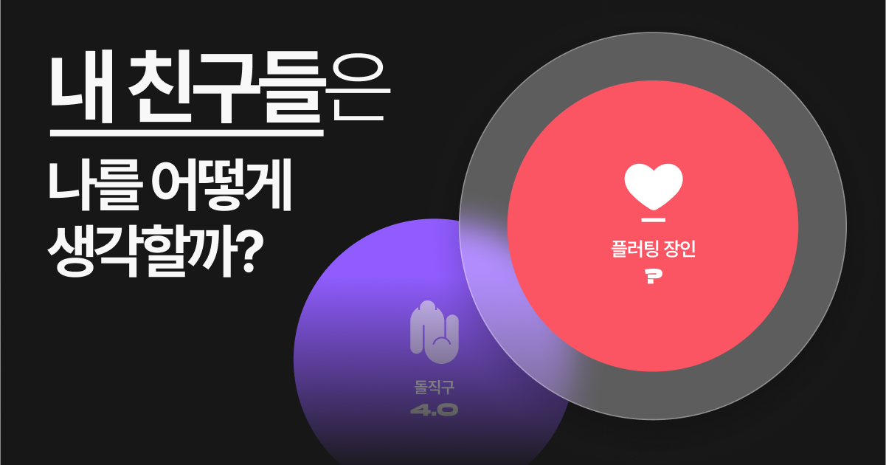

<a name="readme-top"></a>

# 🔑 KEYME FRONTEND



## 👟 개발하기

- 📦 의존성 설치하기

```shell
yarn
```

- 🏃 개발서버 실행하기

```shell
yarn dev
```

- 🏗️ 빌드하기

```shell
yarn build
```

## 🧑‍💻 팀 구성

<table>
  <tr>
    <td align="center">
      <a href="https://github.com/alstn2468">
        
        <br />
        <sub>
          <b>김민수 (23기)</b>
        </sub>
      </a>
    </td>
  </tr>
</table>

<div align='center'>
  <sub>
    <sup>
      NEXTERS 23nd 인해전술
    </sup>
  </sub>
</div>
